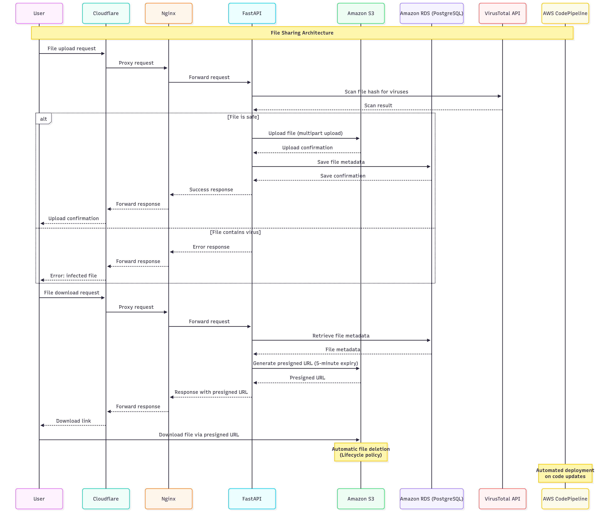

# File Sharing Service

## Overview  
This project is a secure and efficient file-sharing platform that allows users to easily upload and download files. The platform leverages modern cloud technologies and web development best practices to ensure high performance, scalability, and security.  

## Features  
- **Secure File Upload & Download**: Files are uploaded to Amazon S3 using multipart upload and downloaded via links.  
- **Virus Scanning**: Every uploaded file is automatically scanned for viruses using the VirusTotal API.  
- **Automatic File Deletion**: Files are automatically deleted from S3 after 24 hours thanks to lifecycle policies.  
- **User-Friendly Interface**: A simple and intuitive web interface built with HTML, CSS, and JavaScript.  
- **CI/CD**: Automated deployment and updates using AWS CodePipeline.  

## Technologies  

### Backend  
- **FastAPI**: A modern, high-performance web framework for building asynchronous APIs in Python.  
- **Nginx**: Used as a reverse proxy and load balancer.  
- **AWS EC2**: Hosting for the backend application.  
- **AWS S3**: Storage for uploaded files with support for multipart uploads.  
- **AWS RDS (PostgreSQL)**: Management of file metadata in a reliable relational database.  
- **VirusTotal API**: Integration for virus scanning.  

### Frontend  
- **HTML/CSS/JavaScript**: Provides a responsive and user-friendly interface (it is possible to select multiple files at once).  

### Security  
- **Cloudflare**: Protection against DDoS attacks and ensuring data integrity.  

### CI/CD  
- **AWS CodePipeline**: Automation of build, test, and deployment processes.

## Diagram

## Usage  
1. **Uploading Files**:  
   - Go to the web interface at [https://app.nonstudents.online](https://app.nonstudents.online).  
   - Select a file to upload.  
   - The file is uploaded to S3 in parts and scanned for viruses via VirusTotal.  

2. **Downloading Files**:  
   - After successful upload, a download link is generated and can be shared.  

3. **Automatic Deletion**:  
   - Files are automatically deleted from S3 after 24 hours.
